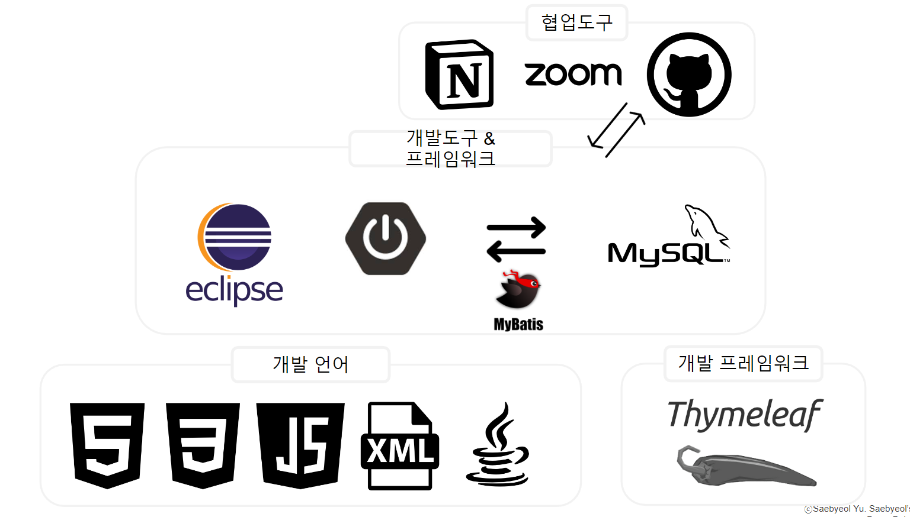
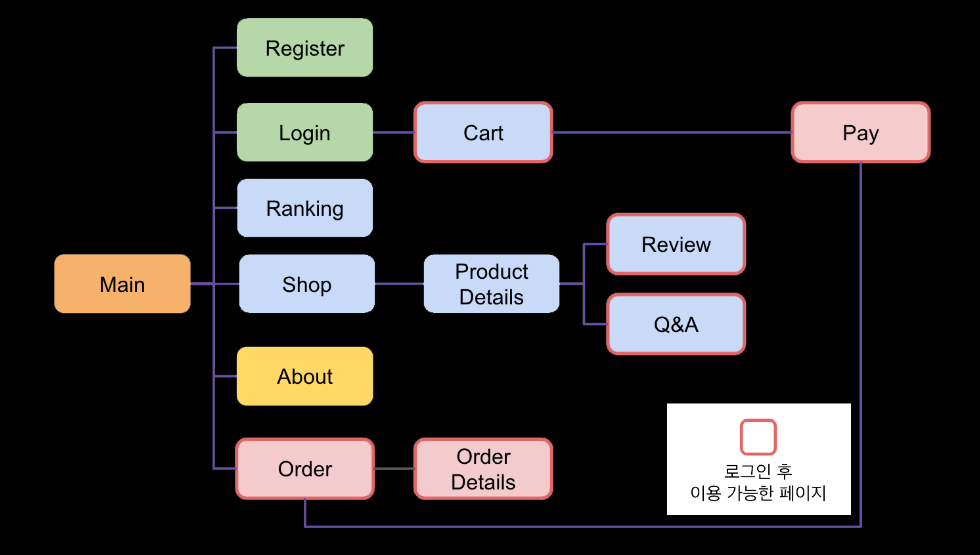
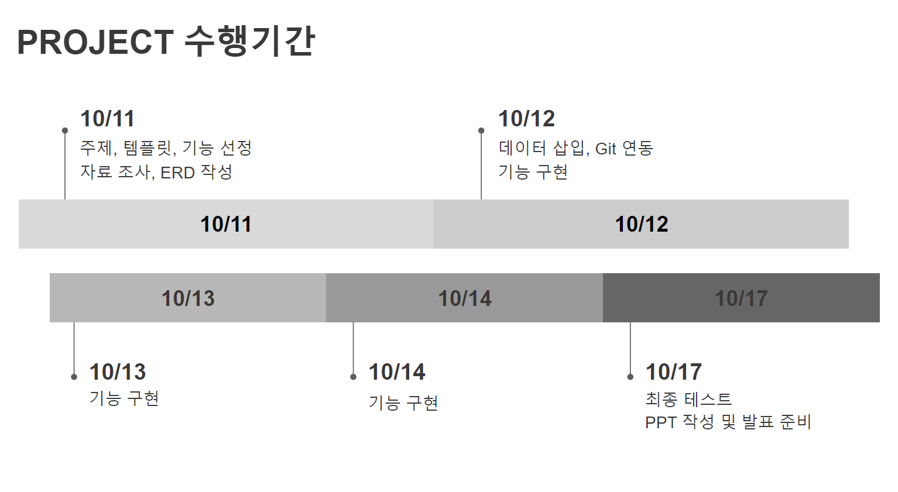
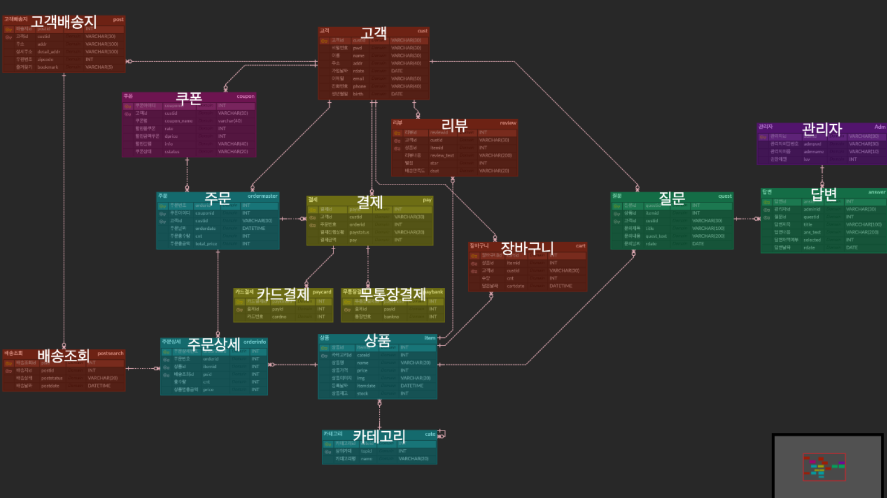

# EtoileBeaute
---
Munlti Campus-Semi Project Team 4
- 쇼핑몰 웹 구현하기
---
## 1. 프로젝트 주제
- Spring boot를 활용한  온라인 쇼핑몰-향수,바디제품 판매 쇼핑몰 서비스 및 CRUD 기능 구현
  
- 쇼핑몰이름선정:Étoile Beauté(에뚜알 보떼 : 아름다운 별) or éternité(영원함/에떼흐-니떼, 영어:eternity) : 향수판매를 주제로 선정하며 향수가 가진 고풍스러운이미지를 형상화하여 프랑스어 단어로 이름선정. 
 
 

 

## 2. 프로젝트 목적
- MySQL을 이용하여 쇼핑몰 데이터 베이스를 구축하고 Spring Container와 연결하는 세미프로젝트

- 자바 개발도구와 통합개발환경(IDE : Intergarated Development Environment) 사용

- ERD Cloud와 Notion, Github을 사용한 협업 경험
 
 

## 3.개발사용도구
|언어|개발도구|Database|협업도구|Framework|
|:---:|:---:|:---:|:---:|:---:|
|Java HTML CSS JavaScript XML|Eclipse SpringBoot |MySQL|Github Zoom Google Docs Notion ERD Cloud|Thymeleaf Mybatis|
 

 
 

## 4. 프로젝트 기능 구현
- 로그인

- 회원가입

- 회사 소개 페이지

- 상품 조회

- 카테고리별 상품 조회

- 상품 상세정보 조회

- 상품별 리뷰/QnA 조회 및 작성

- 장바구니 추가/삭제

- 결재

- 주문 리스트 조회

- 주문 상세 조회

- 최다 판매 상품 랭킹 조회
 
 

 
 

## 5. 프로젝트 구성원 및 역할
| 이름 |
역할|
| :---: |---|
|김희연|
고객리뷰기능구현(별점표시),상품 QNA기능 구현, 주문,결제 기능 구현 |
|김준기|
MainPage구현,로그인기능,랭킹페이지, 전체 Front-End 기능 작업||
|박재형|
회원가입기능, 회사소개 페이지 구현|
|배단비|
장바구니,상품상세페이지,상품조회,랭킹,주문 기능 구현|
|공통|
ERD 설계 및 각 테이블 DTO,CRUD 구현|
 

## 6.프로젝트 수행기간 
 

 

## 7. 데이터베이스 설계
 

 

## 8. 웹 쇼핑몰 구현 화면
 

 
 

## 9.트러블슈팅 💥

| 이름 |
발생오류 |
 해결방법|
| :---: |---|---|
|김희연|
결재 페이지에서 주문 페이지로 넘어갈 때에 url 정의가 잘못되어 주문을 조회시에도 매번 주문이 중복되어 발생하는 문제가 존재|결재페이지에서 주문 페이지로 넘어가는 경우와 주문 조회를 할 경우의 url을 분리하여 해결 |
|박재형|
Git파일 Push할 때 오류가 있는 상태로 Push하여 조원들에게 주의를 받았음.|오류가 있을 때는 올리면 안 된다는 점을 머릿속에 명심하게 되어 잊어먹지 않을 것 같음.|
|김준기|
전체 css파일이 하나로 묶여있어 세부 항목 조율이 어려웠음. 또한 style 구문이 적용이 안되는 현상 발생|클래스별로 css 구문을 나누어  core-style부분 수정으로 새로 작성하여 해결|
|배단비|
 상품 상세페이지에서 tomcat 서버 연결시 화면이 출력되지 않음|href, src를 수정하여 해결함 |

